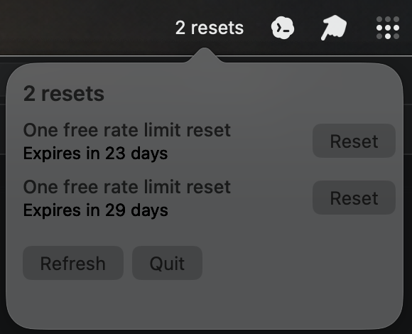

# Codex Reset Monitor

A tiny macOS menu bar app that shows how many Codex rate-limit resets you have available and when each one expires.



## What it shows

In the macOS menu bar, the app displays:

```text
N resets
```

Clicking it opens a compact popover showing:

- each available reset title
- relative expiry time, e.g. `Expires in 23 days`
- a `Reset` button for redeeming that specific reset
- `Refresh` and `Quit` controls

Redeeming a reset requires confirmation before it is consumed.

## How it works

The app calls the same Codex Desktop backend endpoints used by the official Codex app:

- List resets:
  ```http
  GET https://chatgpt.com/backend-api/wham/rate-limit-reset-credits
  ```

- Redeem a reset:
  ```http
  POST https://chatgpt.com/backend-api/wham/rate-limit-reset-credits/consume
  ```

Authentication is read from your existing Codex auth file:

```text
~/.codex/auth.json
```

Specifically, it uses `tokens.access_token`. If this file is missing or expired, sign in with Codex/Codex CLI again.

## Build

From this repo:

```bash
CodexResetMenuBar/build.sh
```

This creates:

```text
CodexResetMenuBar/Codex Reset Monitor.app
```

## Run

```bash
open "CodexResetMenuBar/Codex Reset Monitor.app"
```

## Install

Copy the app into `/Applications`:

```bash
cp -R "CodexResetMenuBar/Codex Reset Monitor.app" /Applications/
open "/Applications/Codex Reset Monitor.app"
```

## Launch at login

1. Open **System Settings**
2. Go to **General → Login Items**
3. Add `Codex Reset Monitor.app`

## Environment overrides

Optional:

```bash
CODEX_AUTH_JSON=/path/to/auth.json
CODEX_API_BASE_URL=https://chatgpt.com/backend-api
```

## CLI helper

This repo also includes `codex-reset.py`, a simple terminal CLI:

```bash
./codex-reset.py list --available
./codex-reset.py redeem auto --yes
./codex-reset.py redeem RateLimitResetCredit_... --yes
```
